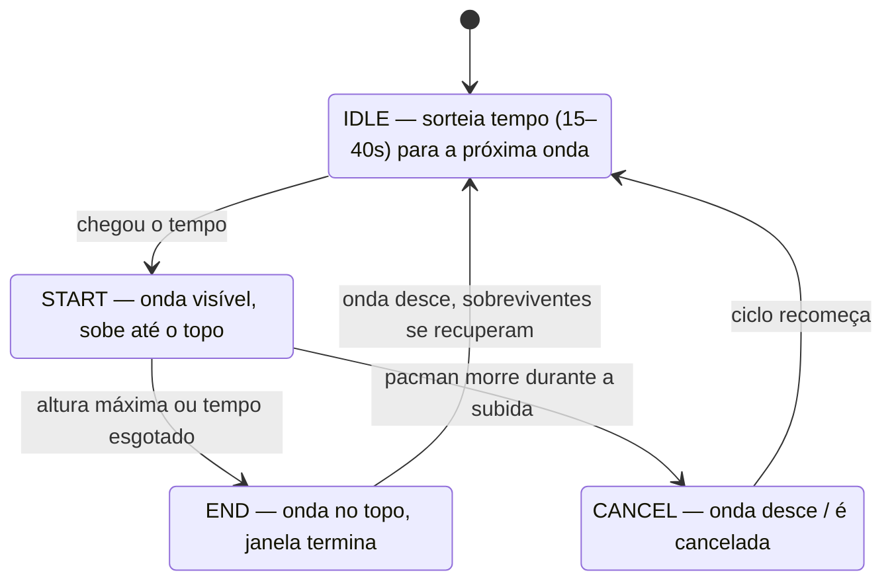
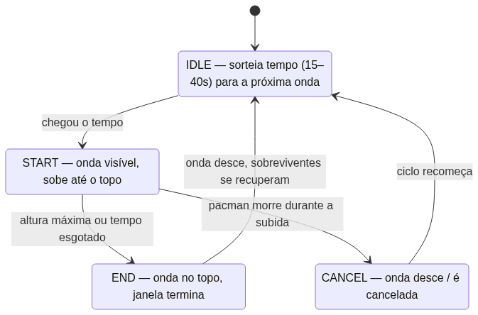
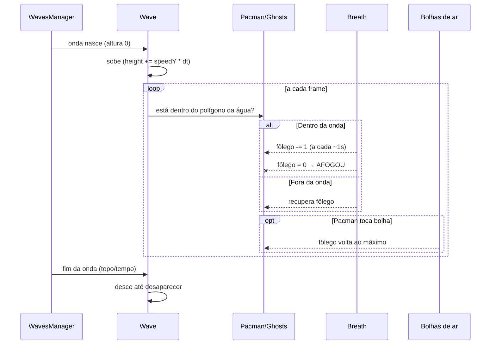
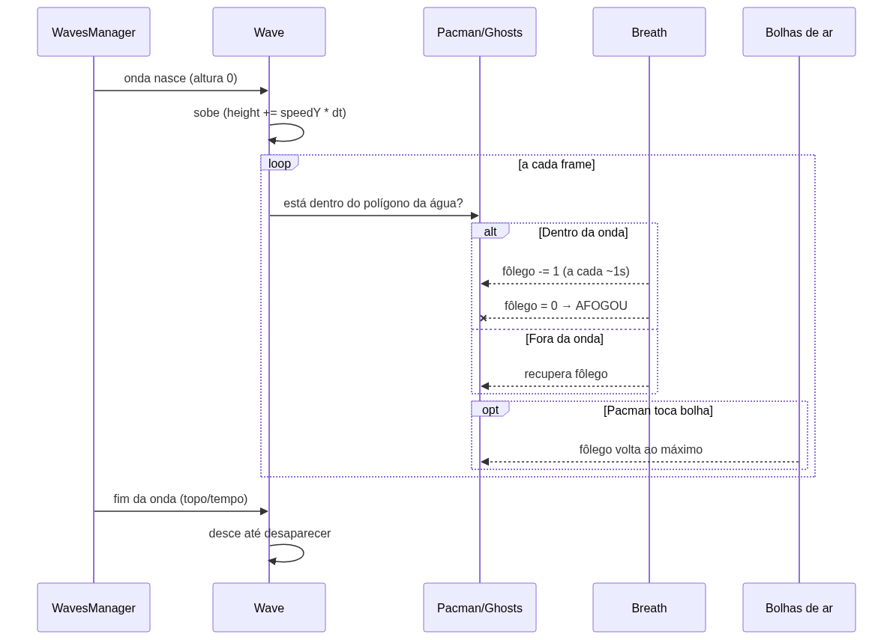
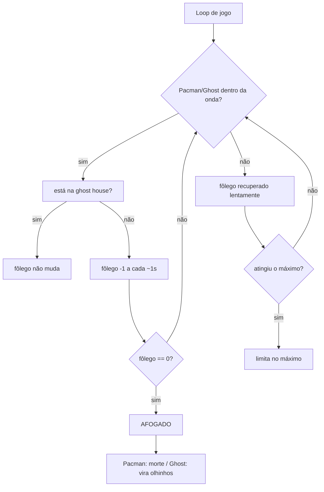
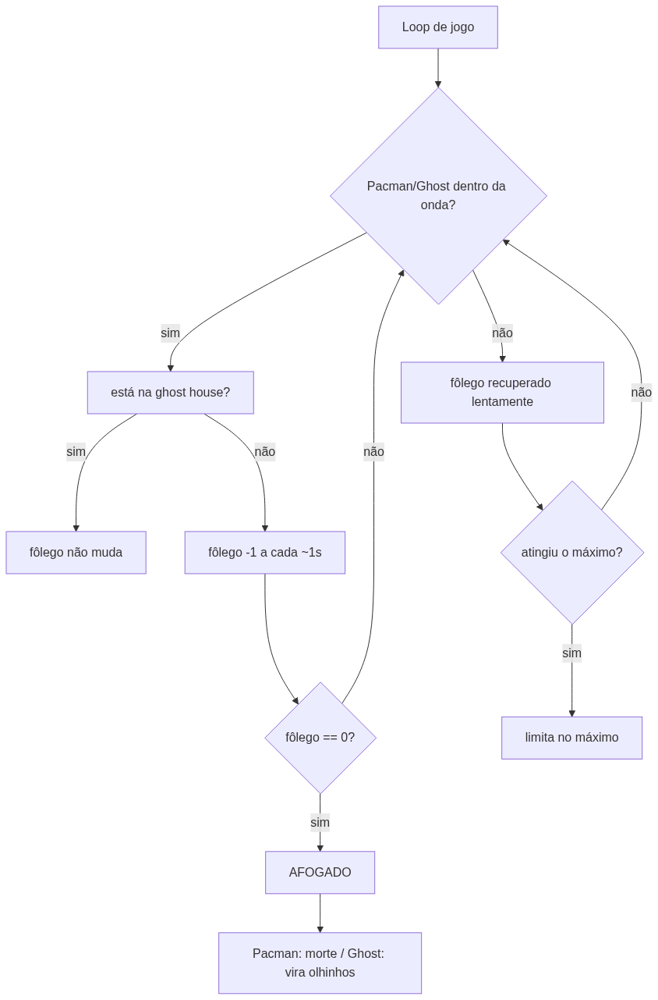

# Relatório Técnico — Mecânica da "Onda que Afoga"

## 1. Objetivo

Periodicamente, uma onda sobe pelo tabuleiro do jogo. Pacman e fantasmas que ficam
**submersos** perdem fôlego continuamente e, se permanecerem debaixo d'água por tempo
suficiente, **se afogam**. O labirinto permanece **visível atrás da onda** (a água é
translúcida e não apaga a cena).

Fluxo resumido:

```
pausa (15–40s) → onda sobe → submersos perdem fôlego → bolhas de ar dão fôlego →
fim da onda → onda desce → sobreviventes recuperam fôlego → nova pausa
```

## 2. Expectativa visual (fases da onda)

```
T[0]            T[1]~T[2]        T[3]          T[4]
┌─────────┐     ┌─────────┐     ┌─────────┐   ┌─────────┐
│▓▓▓▓▓▓▓▓▓│     │▓▓▓▓▓▓▓▓▓│     │▓▓▓▓▓▓▓▓▓│   │▓▓▓▓▓▓▓▓▓│
│▓▓▓▓▓▓▓▓▓│     │▓▓▓▓▓▓▓▓▓│     │▓▓▓▓▓▓▓▓▓│   │▓▓▓▓▓▓▓▓▓│
│░▓▓▓▓▓▓▓░│     │▓▓▓▓▓▓▓▓▓│●    │▓▓▓▓▓▓▓▓▓│   │▓▓▓▓▓▓▓▓▓│
│░░▓▓▓▓▓░░│  →  │▓▓▓▓▓▓▓▓▓●│↓    │▓▓▓▓▓▓▓▓▓│ → │▓▓▓▓▓▓▓▓▓│
│░░░▓▓▓░░░│     │▓▓▓▓▓▓▓▓▓│↗    │▓▓▓▓▓▓▓▓▓│   │▓▓▓▓▓▓▓▓▓│
│pacman●  │     │▓▓▓▓▓▓▓▓▓│↗    │▓▓▓▓▓▓▓▓▓│   │▓▓▓▓▓▓▓▓▓│
└─────────┘     └─────────┘     └─────────┘   └─────────┘
 IDLE          ONDA SOBE      ONDA NO TOPO   ONDA DESCE /
 (pausa de     (nível sobe;   (máx. ou       RECOMEÇA
 15–40s)       submersos       tempo esgota)
               perdem fôlego
```

- **▓** — área coberta/efeito da água
- **●** — Pacman
- setas indicam movimento da onda

## 3. Gráfico: Nível da água × Tempo

```
Nível
100% ┤          ╭───╮
     │        ╭─╯   ╰──╮
     │      ╭─╯        ╰────╮
 50% ┤    ╭─╯              ╰──╮
     │  ╭─╯                  ╰╮
     ├──╯                      ╰──────
   0 └──────────────────────────────────▶ tempo
      └ Idle └ Subida └ Topo/descida └ Idle
```

- **Subida**: fôlego cai (risco de afogamento).
- **Topo / descida**: fim da janela; entidades que chegaram a 0 se afogam.

## 4. Diagrama de estados





## 5. Diagrama de sequência (afogamento)





## 6. Fluxograma do fôlego





## 7. Passos de design (comportamento)

1. **Onda como entidade**
   - É um `Sprite` retângulo que cresce (`height`) + um `Graphics` que desenha o corpo
     d'água como polígono azul translúcido seguindo os limites das paredes do labirinto,
     com borda ondulada no topo.
   - Transparência (`alpha`) e ordem de desenho (`zIndex`) mantêm o **labirinto visível**.

2. **Crescimento / descida**
   - Subida: `height += speedY * (elapsedMs/1000)`; a posição deriva da altura
     (`y = maze.height - height`).
   - Descida: mesma lógica com fator maior (`speedY * 1.3`).
   - As bolhas aparecem conforme a onda avança pelas células e são removidas na descida.

3. **Máquina de estados** (Idle → Start → End / Cancel → Idle) organiza o ciclo,
   cada estado com `start()`, `update(elapsedMs)` e `draw()`.

4. **Sistema de fôlego (drowning)**
   - Cada personagem tem uma reserva `breath` (ex.: máximo 10).
   - Dentro do polígono: perde 1 ponto por segundo.
   - Fora: recupera lentamente até o máximo.
   - Zero → afogamento.

5. **Interações**
   - **Ghost house protegida**: fantasmas dentro dela não perdem fôlego.
   - **Bolhas de ar**: dão fôlego máximo ao serem tocadas e tocam som.
   - **Sons**: subida, bolhas, afogamento.

6. **Ciclo completo** fecha e recomeça sozinho enquanto o jogo roda.

## 8. Pontos de atenção (observados no código atual)

- O labirinto **sumir durante a onda** era causado pela forma como o retângulo/`Graphics`
  era desenhado e pela altura do sprite — resolver com transparência e z-ordering,
  desenhando a agua sobre a cena sem apagá-la.
- Ao criar/remover a onda, guardar e restaurar referências de `container`/`stage`
  para **não poluir a cena** (bolhas/elementos órfãos).
- A detecção de dentro/fora usa os **bounds do polígono** (a água não é um retângulo
  simples, acompanha as paredes e a ghost house).

## 9. Bibliotecas usadas

### 9.1 Tempo de execução

| Biblioteca | Versão | Uso no mecanismo |
|---|---|---|
| `pixi.js` | ^7.4.3 | Renderização: `Sprite`, `Container`, `Graphics`, `Texture`, `ObservablePoint`, `Point`, `Polygon`, `Rectangle`, `Assets`/`Cache` para carregar texturas |
| `@pixi/graphics-extras` | ^7.4.3 | Formato avançado do corpo d'água: `drawRoundedShape`, `beginHole`/`endHole` (buracos p/ ghost house) |
| `@pixi/sound` | ^5.2.3 | Efeitos sonoros: subida da onda, bolhas, afogamento |
| `eventemitter3` | ^4.0.6 | Eventos de jogo (ex.: `pacman-death`, `flood-start`, `flood-end`, `eat-ghost`) |

### 9.2 Desenvolvimento / build (dev)

| Ferramenta | Uso |
|---|---|
| `typescript` | Código-fonte em `.ts` |
| `gulp` | Orquestração das tarefas de build/watch |
| `esbuild` | Bundle rápido (substituiu browserify/watchify) |
| `sass` + `gulp-sass` | Estilos (`scss`) |